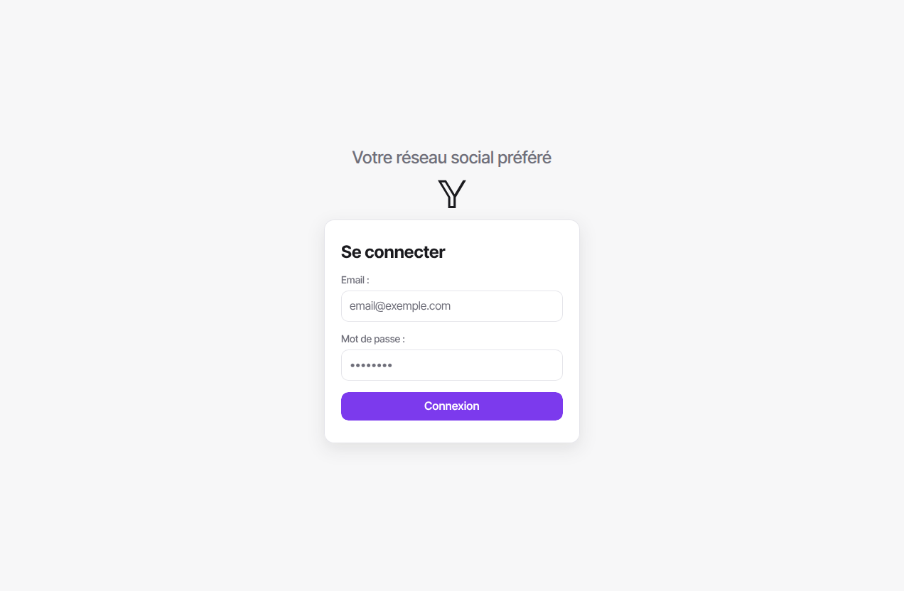
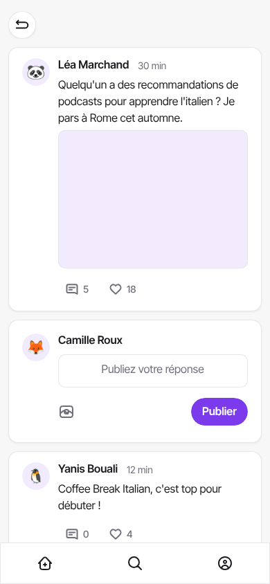
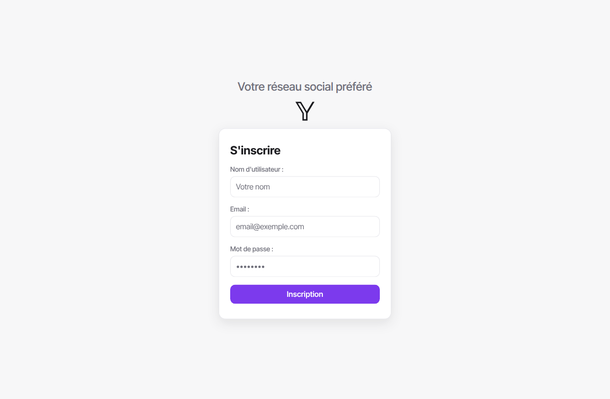
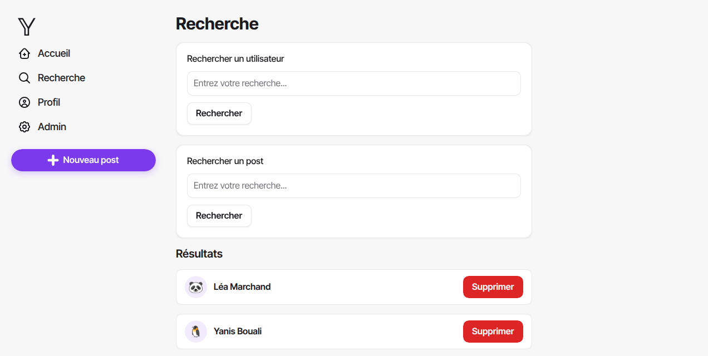
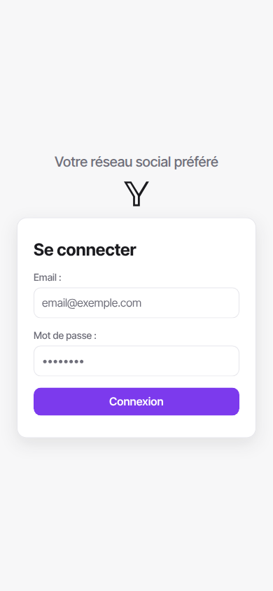
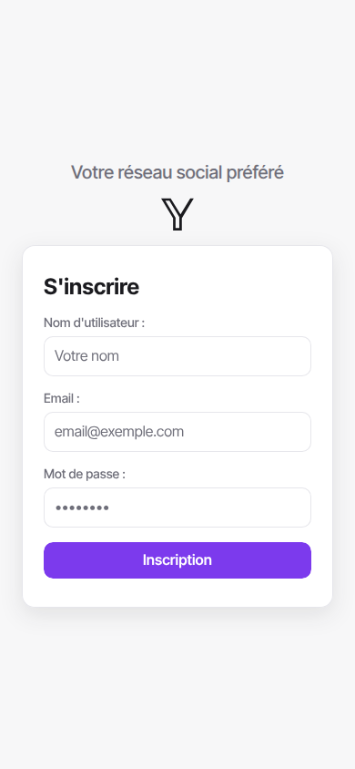
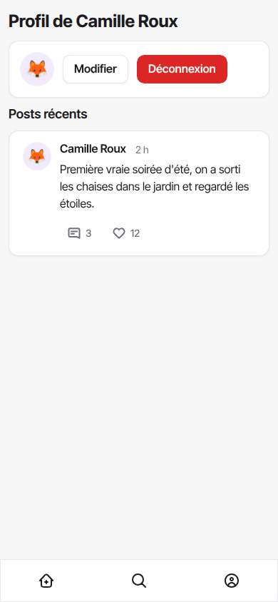
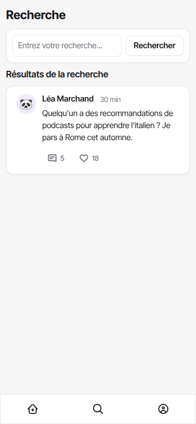
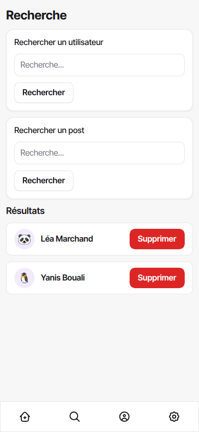

<div class="titlepage">

<span class="smallcaps">Titre professionnel</span>  
<span class="smallcaps">Concepteur Développeur d’Applications</span>  
Niveau 6 (Cadre national des certifications)  
RNCP 37873 — Code titre TP-01281  

------------------------------------------------------------------------

  
**Dossier de projet**  
**Solage**  
*Réseau social de microblogging — application web sécurisée multicouche*  

------------------------------------------------------------------------

  

<div class="minipage">

<div class="flushleft">

**Candidat :**  
Adam <span class="smallcaps">Courtaro</span>  
**Projet :**  
Réalisé en formation

</div>

</div>

<div class="minipage">

<div class="flushright">

**Session :**  

------------------------------------------------------------------------

  
**Centre :**  

------------------------------------------------------------------------

</div>

</div>

Dossier rendant compte de la mise en œuvre des onze compétences professionnelles du titre, réparties sur les trois certificats de compétences professionnelles (CCP).  
*Document de 40 à 60 pages hors page de garde, sommaire et annexes — schémas et illustrations compris.*

</div>

# Liste des compétences mises en œuvre

Ce dossier rend compte de la réalisation du projet <span class="smallcaps">Solage</span>, une application web de microblogging développée en formation, support de la mise en œuvre des **onze compétences professionnelles** du titre *Concepteur Développeur d’Applications* (RNCP 37873), réparties sur les trois certificats de compétences professionnelles (CCP).

Le tableau <a href="#tab:competences" data-reference-type="ref" data-reference="tab:competences">1.1</a> constitue la *grille de lecture* du jury : chaque compétence y est reliée à la preuve concrète qui la démontre dans <span class="smallcaps">Solage</span> et au chapitre où elle est développée.

<div id="tab:competences">

| **\#** | **Compétence** | **CCP** | **Preuve principale dans <span class="smallcaps">Solage</span>** | **Statut** |
|:--:|:---|:--:|:---|:--:|
| C1 | Installer et configurer son environnement de travail | 1 | Docker (FrankenPHP, Caddy, Traefik, PostgreSQL), Git, Composer, conteneurs dev = prod | <span style="color: juryGreen">**OK**</span> |
| C2 | Développer des interfaces utilisateur | 1 | Vues `modules/views/`, JS vanilla, AJAX, échappement XSS, CSP | <span style="color: juryGreen">**OK**</span> |
| C3 | Développer des composants métier | 1 | Contrôleurs `modules/controllers/`, autorisation, contrôle IDOR, CSRF | <span style="color: juryGreen">**OK**</span> |
| C4 | Contribuer à la gestion d’un projet informatique | 1 | Git, feuille de route, journal de décisions, comptes rendus de session | <span style="color: juryGreen">**OK**</span> |
| C5 | Analyser les besoins et maquetter une application | 2 | Expression des besoins (ch. <a href="#ch:besoins" data-reference-type="ref" data-reference="ch:besoins">2</a>), maquettes (Penpot) & enchaînement | <span style="color: juryGreen">**OK**</span> |
| C6 | Définir l’architecture logicielle d’une application | 2 | MVC multicouche, Router, middlewares, schéma DICP | <span style="color: juryGreen">**OK**</span> |
| C7 | Concevoir et mettre en place une base de données relationnelle | 2 | `solage.pg.sql`, migrations idempotentes, `seed.sql` | <span style="color: juryGreen">**OK**</span> |
| C8 | Développer des composants d’accès aux données SQL et NoSQL | 2 | `modules/models/`, PDO requêtes préparées, anti-injection | <span style="color: juryGreen">**OK**</span> |
| C9 | Préparer et exécuter les plans de tests | 3 | Plan de tests + tests unitaires / sécurité (PHPUnit) | <span style="color: red">**À développer**</span> |
| C10 | Préparer et documenter le déploiement | 3 | `docker-compose.prod.yml`, Traefik HTTPS, procédure | <span style="color: todoOrange">**Partiel**</span> |
| C11 | Contribuer à la mise en production (DevOps) | 3 | Conteneurs, migrations, intégration continue (CI) | <span style="color: todoOrange">**Partiel**</span> |

Cartographie des onze compétences professionnelles et de leur preuve dans <span class="smallcaps">Solage</span>.

</div>

##### Compétences transversales.

Elles sont évaluées *à travers* les compétences professionnelles :

- **Communiquer en français et en anglais** : dossier et présentation structurés, commentaires de code et vocabulaire technique en anglais (niveau B1) ;

- **Mettre en œuvre une démarche de résolution de problème** : voir le chapitre <a href="#ch:bilan" data-reference-type="ref" data-reference="ch:bilan">5</a> (bugs diagnostiqués et résolus : `STDOUT` CLI, *headers already sent*, requête N+1) ;

- **Apprendre en continu** : veille de sécurité ayant conduit à la correction d’une faille IDOR (section <a href="#sec:veille" data-reference-type="ref" data-reference="sec:veille">4.15</a>).

# Expression des besoins

<span class="smallcaps">Solage</span> étant un projet réalisé *pendant la formation*, sans commanditaire externe, c’est moi qui formule l’expression des besoins définissant les objectifs et les limites du projet, comme le prévoit le référentiel de certification.

## Contexte et problème adressé

<span class="smallcaps">Solage</span> est un **réseau social de microblogging** inspiré de X (anciennement Twitter) : un utilisateur publie de courts messages, éventuellement accompagnés d’une image, auxquels les autres peuvent répondre dans un fil imbriqué et réagir par un « j’aime ».

Le besoin pédagogique sous-jacent est de se confronter à *l’ensemble des briques d’une application web sécurisée multicouche* sur un périmètre fonctionnel maîtrisable : authentification, opérations de création / lecture / mise à jour / suppression (CRUD), relations récursives (réponses imbriquées), téléversement de fichiers, recherche et modération. Ce périmètre, volontairement resserré, permet de traiter **la sécurité à chaque couche** plutôt que d’empiler des fonctionnalités superficielles.

## Objectifs du projet

Les objectifs sont formulés de manière *vérifiable* :

- permettre à un visiteur de **s’inscrire**, de **se connecter** et de se déconnecter ;

- permettre à un utilisateur authentifié de **publier** un message (avec image facultative), d’y **répondre** dans un fil imbriqué, de l’**aimer**, de **rechercher** des utilisateurs et des messages, et d’**éditer son profil** ;

- permettre à un **administrateur** de **modérer** (supprimer tout contenu, accéder à une page d’administration) ;

- garantir, de manière transverse, la **sécurité applicative** (protection contre les failles XSS, CSRF, injection SQL, IDOR) conformément aux recommandations de l’OWASP et de l’ANSSI, ainsi que la conformité au RGPD et la prise en compte du RGAA.

## Périmètre et limites

Le **hors-périmètre** est assumé explicitement : il traduit un arbitrage de maturité, et non un oubli. Ne font pas partie du projet :

- la messagerie privée entre utilisateurs ;

- les notifications en temps réel (WebSocket) ;

- la fédération inter-instances et les API publiques ouvertes ;

- toute fonctionnalité de paiement ou de monétisation.

## Acteurs et cas d’usage

Trois acteurs interagissent avec le système, selon une relation de *généralisation* : l’administrateur est un utilisateur particulier, lui-même un visiteur authentifié.

<div id="tab:acteurs">

| **Acteur** | **Cas d’usage principaux** |
|:---|:---|
| Visiteur | Consulter la page de connexion, s’inscrire, se connecter |
| Utilisateur | Consulter le fil, publier, répondre, aimer, rechercher, éditer son profil, supprimer son propre contenu |
| Administrateur | Tous les cas de l’utilisateur *plus* la modération (supprimer tout contenu, page d’administration) |

Acteurs et cas d’usage.

</div>

Quelques *user stories* représentatives, qui serviront de base au diagramme de cas d’utilisation (section <a href="#sec:uml" data-reference-type="ref" data-reference="sec:uml">4.5</a>) et au plan de tests (chapitre <a href="#ch:tests" data-reference-type="ref" data-reference="ch:tests">4.11</a>) :

- *En tant que* visiteur, *je veux* créer un compte *afin de* publier des messages.

- *En tant qu’*utilisateur, *je veux* publier un message avec une image *afin de* partager du contenu.

- *En tant qu’*utilisateur, *je veux* répondre à un message *afin de* participer à une conversation.

- *En tant qu’*administrateur, *je veux* supprimer n’importe quel message *afin de* modérer la plateforme.

## Contraintes réglementaires et qualité

##### RGPD.

L’application traite des données à caractère personnel (adresse email, mot de passe, contenus publiés). Le mot de passe n’est jamais stocké en clair : il est haché (`bcrypt`). La collecte est minimale (principe de minimisation). Des mentions légales et une information sur la finalité du traitement doivent accompagner la mise en production.

##### RGAA (accessibilité).

Les interfaces visent un socle d’accessibilité : attributs `alt` sur les images, contrastes suffisants, libellés de formulaire, navigation au clavier et attributs `aria-*` sur les éléments interactifs (par exemple le champ de saisie de message porte `role="textbox"` et `aria-label`).

##### Éco-conception.

Plusieurs choix limitent l’empreinte : minification des assets en production, pagination du fil (`LIMIT 20`), et suppression d’une requête N+1 réduisant le nombre d’allers-retours vers la base (section <a href="#sec:acces" data-reference-type="ref" data-reference="sec:acces">4.8</a>).

# Environnement technique

## Vue d’ensemble de la pile technique

<span class="smallcaps">Solage</span> repose sur une pile volontairement légère, dont je maîtrise chaque brique.

<div id="tab:stack">

| **Couche** | **Technologie** | **Rôle** |
|:---|:---|:---|
| Langage | PHP 8.3 (`declare(strict_types=1)`) | Logique applicative |
| SGBD | PostgreSQL 16 via PDO | Persistance relationnelle |
| Serveur applicatif | FrankenPHP (Caddy intégré) | Exécution de PHP, service du statique |
| Reverse proxy / edge | Traefik v3 | Routage, terminaison TLS (Let’s Encrypt) |
| Conteneurisation | Docker, `docker compose` | Reproductibilité dev = prod |
| Dépendances | Composer | `minify`, `phpdotenv`, `psr/log` |
| Front-end | HTML, CSS, JavaScript vanilla | Interfaces et appels AJAX (`fetch`) |
| Gestion de versions | Git | Historique et traçabilité |

Pile technique de <span class="smallcaps">Solage</span>.

</div>

## Justification des choix techniques

Chaque choix est un compromis explicite, formulé selon le schéma « X plutôt que Y parce que Z, en acceptant le coût W ».

MVC maison plutôt qu’un framework (Symfony, Laravel).  
Objectif pédagogique : *comprendre et posséder* le routeur, l’autoloader et le cycle requête / réponse, plutôt que de déléguer à de la « magie » non maîtrisée. Coût assumé : réécrire des briques qu’un framework fournirait. En contexte professionnel, un framework serait retenu.

PostgreSQL plutôt que MariaDB.  
Typage strict, séquences (`SERIAL`), robustesse et conformité SQL. Le projet a d’ailleurs été *migré* de MariaDB vers PostgreSQL, ce qui a imposé d’adapter le schéma (`AUTO_INCREMENT` $`\to`$ `SERIAL`, `datetime` $`\to`$ `TIMESTAMP`).

FrankenPHP plutôt qu’Apache ou Nginx + PHP-FPM.  
Un seul binaire embarquant Caddy, terminaison TLS automatique, image Docker simple.

Traefik plutôt que Nginx en reverse proxy.  
Configuration *par labels Docker*, certificats Let’s Encrypt automatiques, découverte dynamique des services.

PDO plutôt qu’une extension native.  
Abstraction portable et, surtout, **requêtes préparées** qui neutralisent l’injection SQL (section <a href="#sec:acces" data-reference-type="ref" data-reference="sec:acces">4.8</a>).

## Poste de travail et outils

L’environnement de développement réunit : un IDE, **Git** pour la gestion de versions (historique de *commits* conventionnels, une fonctionnalité par série de commits), **Composer** pour les dépendances (`composer.json` / `composer.lock`), et une gestion rigoureuse des **secrets**. Les identifiants de base de données ne figurent jamais dans le code : ils sont chargés depuis un fichier `.env` (ignoré par Git) au moyen de la bibliothèque `vlucas/phpdotenv`, un gabarit `.env.example` documentant les variables attendues.

```
$envPath = dirname(__DIR__);
if (file_exists($envPath . '/.env')) {
    $dotenv = Dotenv\Dotenv::createImmutable($envPath);
    $dotenv->load();
}
// ... lecture de DB_HOST, DB_NAME, DB_USER, DB_PASSWORD ...
$dsn = "pgsql:host={$host};port={$port};dbname={$dbname};options='--client_encoding=UTF8'";
$options = [
    PDO::ATTR_ERRMODE            => PDO::ERRMODE_EXCEPTION,
    PDO::ATTR_DEFAULT_FETCH_MODE => PDO::FETCH_ASSOC,
    PDO::ATTR_EMULATE_PREPARES   => false,   // vraies requêtes préparées côté serveur
];
$this->connection = new PDO($dsn, $user, $password, $options);
```

La désactivation de `ATTR_EMULATE_PREPARES` force de *vraies* requêtes préparées côté serveur PostgreSQL, renforçant la protection contre l’injection SQL.

## Conteneurisation (Docker)

L’application est décrite par deux piles `docker compose` : l’une pour le développement, l’autre pour la production.

##### Développement.

Traefik en HTTP, FrankenPHP en *bind-mount* du code (rechargement à chaud), PostgreSQL exposé sur le port 5432 (pour les outils locaux), et un service `migrate` exécuté une seule fois avant le démarrage de l’application. Un *healthcheck* PostgreSQL garantit l’ordre de démarrage.

```
app:
    build: { context: ., dockerfile: Dockerfile }
    image: solage-app
    volumes:
      - ./:/app          # rechargement du code à chaud en dev
      - /app/vendor      # vendor/ provient de l'image
    depends_on:
      postgres: { condition: service_healthy }
      migrate:  { condition: service_completed_successfully }
    labels:
      - traefik.enable=true
      - traefik.http.routers.solage.rule=Host(`localhost`)

  postgres:
    image: postgres:16-alpine
    healthcheck:
      test: ["CMD-SHELL", "pg_isready -U $${POSTGRES_USER} -d $${POSTGRES_DB}"]
      interval: 5s
```

##### Production.

Traefik en HTTPS (Let’s Encrypt, redirection HTTP $`\to`$ HTTPS), en-tête HSTS, FrankenPHP servi depuis l’image (sans *bind-mount*), et PostgreSQL *non exposé* (accessible uniquement sur le réseau interne). Le détail figure en section <a href="#sec:deploiement" data-reference-type="ref" data-reference="sec:deploiement">4.13</a> (préparation du déploiement).

# Réalisations

Ce chapitre, cœur du dossier, présente les réalisations qui mettent en œuvre les compétences : l’architecture logicielle, la gestion de projet, la conception (maquettes, modèle de données, diagrammes UML), le développement (interfaces, composants métier, accès aux données), la sécurité, puis les tests et la veille.

## Architecture logicielle multicouche

<span class="smallcaps">Solage</span> suit une architecture **MVC multicouche**, où chaque couche porte une responsabilité unique *et* un rôle de sécurité. La figure <a href="#fig:archi" data-reference-type="ref" data-reference="fig:archi">4.1</a> en donne la vue d’ensemble.

<figure id="fig:archi">

<figcaption>Architecture multicouche de <span class="smallcaps">Solage</span> : du navigateur au SGBD.</figcaption>
</figure>

### Règles de séparation des couches

Le découpage est imposé par des règles strictes que je me suis fixées, vérifiables à la lecture du code :

- **aucun SQL hors de `modules/models/`** : un contrôleur appelle une méthode de modèle, il n’écrit jamais de requête ;

- **aucune sortie (`echo`) hors de `modules/views/`** et de l’entrée `public/index.php` ;

- **aucun accès à `$_POST` / `$_GET` / `$_SESSION` hors des contrôleurs et de `SessionManager`** ;

- **aucun appel direct à `Database::getConnection()` hors des modèles**, de `Migrations` et du *bootstrap*.

Le dossier `src/` regroupe le code « framework » (le routeur, les middlewares, le logger, les utilitaires, le gestionnaire de session, les migrations), distinct du code « métier » (`modules/`). Cette séparation entre infrastructure réutilisable et domaine applicatif est un marqueur d’architecture mûre.

### Rôle de sécurité de chaque couche (DICP)

La stratégie de sécurité se lit couche par couche selon les quatre indicateurs de l’ANSSI : **D**isponibilité, **I**ntégrité, **C**onfidentialité, **P**reuve.

<div id="tab:dicp">

| **Couche** | **Mécanisme de sécurité** | **Indicateur DICP** |
|:---|:---|:---|
| Edge (Traefik) | TLS / HTTPS, HSTS, isolation réseau | Intégrité, Confidentialité |
| Bootstrap (`index.php`) | En-têtes CSP / nosniff, cookie `HttpOnly` / `Secure` / `SameSite` | Intégrité, Confidentialité |
| Middlewares (`src/`) | Jeton CSRF, authentification, autorisation ; refus journalisé | Intégrité, Confidentialité, Preuve |
| Contrôleurs | Validation des entrées, contrôle d’accès par ressource (anti-IDOR) | Intégrité, Confidentialité |
| Modèles (PDO) | Requêtes préparées (anti-injection SQL), transactions | Intégrité |
| Vues | Échappement systématique `Utils::e()` (anti-XSS) | Intégrité |
| SGBD (PostgreSQL) | Contraintes, clés étrangères, index, comptes & droits | Disponibilité, Intégrité |

Rôle de sécurité de chaque couche, selon les indicateurs DICP.

</div>

### Patrons mis en œuvre

L’architecture mobilise plusieurs patrons de conception : *Front Controller* (`public/index.php`, point d’entrée unique), *MVC* (séparation modèle / vue / contrôleur), *Middleware* (chaîne de traitement transverse pour l’authentification, l’autorisation et le CSRF) et *Injection de dépendance* (le `SessionManager` reçoit son `UserModel` par constructeur, ce qui le rend testable).

## Gestion de projet

J’ai réalisé l’essentiel de ce projet — un binôme a contribué ponctuellement à l’amorçage, en 2024. Je l’ai mené selon une démarche **itérative légère** (proche de Kanban), en deux temps : une **construction initiale** (2024), puis une **reprise** dédiée à la sécurisation et à l’industrialisation (2026 : conteneurisation, migration PostgreSQL, sécurité, refonte MVC). Sur un projet de cette taille, j’ai assumé l’ensemble des rôles : planification, suivi et qualité.

##### Planification.

Ma feuille de route (`ROADMAP_DETAILLEE.md`) découpe le travail en phases, fixe leurs priorités au regard du risque par bloc de compétences, et me sert de *backlog* de référence.

##### Suivi des tâches.

J’ai suivi mes tâches au fil des commits **Git** — chaque tâche correspond à un ou plusieurs commits datés — et j’en ai consolidé la trace dans un fichier `SUIVI.md` (tâche, phase, date). Cette trace, vérifiable, me tient lieu de tableau de bord et permet de rapprocher le réalisé du planifié.

##### Qualité.

Je me suis fixé des règles de qualité — séparation stricte des couches, requêtes préparées systématiques, échappement systématique des sorties — et je les ai fait respecter en me relisant à chaque fonctionnalité, comme une revue de code à une personne.

##### Journal de décisions.

Un journal des décisions techniques (`Probleme-Solution.md`) consigne, pour chaque choix structurant, le contexte, le problème, les options envisagées, la solution retenue et sa justification. Il me tient lieu de comptes rendus de session.

##### Comptes rendus de session.

À partir de l’historique Git et du journal de décisions, j’ai reconstitué les comptes rendus de mes principales sessions de travail. Chacun consigne l’**objectif** visé, le **réalisé** — rattaché à des commits datés — et le **reste à faire** identifié en fin de session, ce dernier alimentant en retour la feuille de route. Le tableau <a href="#tab:cr" data-reference-type="ref" data-reference="tab:cr">4.2</a> en donne la synthèse ; les comptes rendus détaillés et un extrait du fichier de suivi figurent en annexe <a href="#ann:gestion" data-reference-type="ref" data-reference="ann:gestion">6.1</a>.

<div id="tab:cr">

| **Date** | **Objectif de la session** | **Reste à faire identifié** |
|:---|:---|:---|
| 6 mai 2026 | Industrialiser l’environnement : conteneurisation et migration PostgreSQL | Validation du type MIME des téléversements ; régénération d’ID de session |
| 12 mai 2026 | Auditer l’architecture MVC et corriger les failles applicatives (XSS, IDOR) | Validation serveur systématique ; tests automatisés |
| 13 mai 2026 | Fiabiliser le jeu d’essai et la charte graphique | Procédure de sauvegarde / restauration |
| 15 juin 2026 | Durcir la sécurité (CSRF, en-têtes) et outiller la qualité (PSR-12) | Intégration continue ; couverture de tests |

Synthèse des comptes rendus de session (détail en annexe <a href="#ann:gestion" data-reference-type="ref" data-reference="ann:gestion">6.1</a>).

</div>

## Maquettes et enchaînement des écrans

L’application comporte neuf écrans : connexion, inscription, fil d’actualité, détail d’un message, profil utilisateur, édition de profil, recherche, administration et page d’erreur 404. Leur enchaînement est formalisé par la figure <a href="#fig:enchainement" data-reference-type="ref" data-reference="fig:enchainement">4.2</a>.

<figure id="fig:enchainement">

<figcaption>Enchaînement des écrans (storyboard). En vert l’écran protégé par authentification, en orange l’écran réservé à l’administrateur.</figcaption>
</figure>

J’ai délibérément réutilisé les **conventions d’interface éprouvées** du microblogging — fil chronologique, zone de composition en haut, réponses imbriquées, action « j’aime » sous chaque message — plutôt que d’inventer une interface nouvelle. Ces motifs étant déjà familiers aux utilisateurs, les reprendre maximise l’**apprenabilité** et sert les principes ergonomiques de simplicité et de minimalité des affichages. Ma contribution de conception tient dans l’**adaptation** : un périmètre réduit et cohérent, une charte graphique minimaliste propre à Solage, et l’enchaînement des écrans présenté ci-dessus. Le parcours nominal mène de la connexion au fil d’actualité, depuis lequel l’utilisateur accède au détail d’un message, aux profils, à la recherche et — s’il est administrateur — à la modération.

J’ai formalisé ces écrans sous forme de **maquettes**, réalisées avec **Penpot** (outil de maquettage *open source*). Ce sont mes propres écrans — identité visuelle, charte et libellés propres à <span class="smallcaps">Solage</span>, sans aucun élément de marque tiers. Chaque écran est décliné en version **bureau** et **mobile**, actant une conception *responsive*. Les trois écrans les plus structurants sont présentés ici ; les autres figurent en annexe <a href="#ann:maquettes" data-reference-type="ref" data-reference="ann:maquettes">6.5</a>.

<figure id="fig:maq-connexion">

<figcaption>Maquette de l’écran de connexion (bureau).</figcaption>
</figure>

##### Connexion — focaliser sur une tâche unique.

L’écran de connexion isole sa seule tâche dans une **carte centrée** : logo et accroche au-dessus, deux champs étiquetés explicitement (« Email », « Mot de passe »), et un **unique appel à l’action** mis en avant par la couleur d’accent violette. L’absence de tout élément concurrent réduit la charge cognitive et guide l’œil vers l’action attendue.

<figure id="fig:maq-mobile">
<div class="minipage">

</div>
<div class="minipage">

</div>
<figcaption>Maquettes mobiles : le fil d’actualité (à gauche) et le détail d’un message avec sa zone de réponse (à droite).</figcaption>
</figure>

##### Fil et détail — hiérarchie visuelle et constance.

Sur le fil comme sur le détail, la **zone de composition** reste en haut, immédiatement accessible. Chaque message suit la même **hiérarchie visuelle** : nom de l’auteur en gras, horodatage atténué en gris, contenu en corps de texte, puis les actions (« répondre », « j’aime ») alignées sous le message. Sur mobile, une **barre de navigation inférieure** (accueil, recherche, profil) reste constante d’un écran à l’autre, et un bouton de retour ramène du détail vers le fil — deux repères de navigation qui ne bougent jamais.

##### Choix d’accessibilité (RGAA).

Les maquettes intègrent les repères d’accessibilité visés par le projet : libellés de formulaire explicites associés à chaque champ, contraste suffisant entre le texte et le fond, et zones d’action (boutons, icônes) dimensionnées pour le tactile. Ces choix de conception se traduisent dans le code par des attributs `alt`, `aria-label` et des libellés `<label>` (cf. chapitre <a href="#ch:realisations" data-reference-type="ref" data-reference="ch:realisations">4</a>).

## Conception de la base de données

### Modèle conceptuel des données (MCD)

Le modèle conceptuel (figure <a href="#fig:mcd" data-reference-type="ref" data-reference="fig:mcd">4.5</a>) recense trois entités principales : <span class="smallcaps">Utilisateur</span>, <span class="smallcaps">Role</span> et <span class="smallcaps">Post</span>. Les réponses sont modélisées par une association *réflexive* « répond à » sur <span class="smallcaps">Post</span> : une réponse *est* un message qui en référence un autre. Les « j’aime » et les favoris sont des associations entre <span class="smallcaps">Utilisateur</span> et <span class="smallcaps">Post</span>, l’association « aime » portant l’attribut `created_at`.

<figure id="fig:mcd">

<figcaption>Modèle conceptuel des données (formalisme Merise).</figcaption>
</figure>

<div class="info">

**Note —** Le schéma physique conserve une table `responses` héritée d’une première version, alors que le mécanisme de réponse effectivement utilisé par l’application repose sur les colonnes `reply_to` / `reply_to_parent` de la table `posts`. Cette redondance est identifiée comme une dette à résorber : c’est un point que je signale plutôt que de le masquer.

</div>

### Modèle logique / physique (MLD, MPD)

Le passage au modèle logique transforme les associations en clés étrangères. La règle de nommage notable : le mot `user` étant *réservé* en PostgreSQL, les colonnes de clé étrangère se nomment `user_id`. La figure <a href="#fig:mld" data-reference-type="ref" data-reference="fig:mld">4.6</a> présente le schéma relationnel et ses clés étrangères.

<figure id="fig:mld">

<figcaption>Modèle logique des données : tables physiques et clés étrangères (<code>#</code>).</figcaption>
</figure>

Le modèle physique est concrétisé par le script de création `solage.pg.sql`, chargé une seule fois à l’initialisation du conteneur PostgreSQL. L’extrait suivant en montre les tables principales ; le script complet figure en annexe <a href="#ann:sql" data-reference-type="ref" data-reference="ann:sql">6.2</a>.

```
CREATE TABLE roles (
    id   SERIAL PRIMARY KEY,
    name VARCHAR(255) NOT NULL
);

CREATE TABLE users (
    id        SERIAL PRIMARY KEY,
    name      VARCHAR(255) NOT NULL,
    email     VARCHAR(255) NOT NULL UNIQUE,
    password  VARCHAR(255) NOT NULL,
    role      INT NULL REFERENCES roles(id) ON DELETE SET NULL,
    image     VARCHAR(255) NULL
);
CREATE INDEX users_role_idx ON users(role);

CREATE TABLE posts (
    id              SERIAL PRIMARY KEY,
    user_id         INT NULL REFERENCES users(id) ON DELETE CASCADE,
    date            TIMESTAMP NOT NULL,
    content         TEXT NULL,
    reply_to        INT NULL,
    reply_to_parent INT NULL,
    image           TEXT NULL
);
CREATE INDEX posts_user_idx ON posts(user_id);

CREATE TABLE likes (
    id         SERIAL PRIMARY KEY,
    user_id    INT NULL REFERENCES users(id) ON DELETE CASCADE,
    post       INT NULL REFERENCES posts(id) ON DELETE CASCADE,
    response   INT NULL REFERENCES responses(id) ON DELETE CASCADE,
    created_at TIMESTAMP NOT NULL
);
```

L’**intégrité** est garantie par les contraintes : `NOT NULL`, `UNIQUE(email)`, clés étrangères avec `ON DELETE CASCADE` (suppression en cascade des messages d’un utilisateur supprimé) ou `SET NULL`. Des **index** accélèrent les accès fréquents (clés étrangères, fil d’actualité).

### Évolution du schéma : migrations idempotentes

Les évolutions additives ne sont pas appliquées à la main : elles passent par un système de **migrations idempotentes** (`src/Migrations.php`), qui interroge `information_schema` avant d’agir et peut donc être rejoué sans risque.

```
protected function columnExists(string $table, string $column): bool {
    $sql = "SELECT 1 FROM information_schema.columns
            WHERE table_schema = current_schema()
              AND table_name = :table AND column_name = :column LIMIT 1";
    $stmt = $this->db->prepare($sql);
    $stmt->execute([':table' => $table, ':column' => $column]);
    return $stmt->fetchColumn() !== false;
}

public function migrate(): void {
    $this->addColumnIfNotExists('posts', 'reply_to', 'INT', 'NULL');
    $this->addColumnIfNotExists('posts', 'reply_to_parent', 'INT', 'NULL');
    $this->addColumnIfNotExists('posts', 'image', 'TEXT', 'NULL');
}
```

##### Jeu d’essai et restauration.

Un jeu d’essai reproductible (`seed.sql`) peuple une base de test (utilisateurs, messages, « j’aime », réponses).

<div class="todo">

**À développer —** Procédure de sauvegarde / restauration Documenter et illustrer la procédure de sauvegarde et de restauration de la base (`pg_dump` / `pg_restore`), exigée par le critère C7 (« la base de test peut être restaurée en cas d’incident ») : commande de *dump*, emplacement de stockage, commande de restauration, et test de restauration sur une base vierge.

</div>

## Diagrammes UML

### Diagramme de cas d’utilisation

La figure <a href="#fig:usecase" data-reference-type="ref" data-reference="fig:usecase">4.7</a> formalise le comportement attendu : les trois acteurs et leurs cas d’usage, avec la généralisation Administrateur $`\rightarrow`$ Utilisateur $`\rightarrow`$ Visiteur.

<figure id="fig:usecase">

<figcaption>Diagramme de cas d’utilisation de <span class="smallcaps">Solage</span>.</figcaption>
</figure>

### Diagramme de séquence : « Publier un message »

Le cas le plus significatif est la publication d’un message : il traverse toutes les couches et mobilise les protections de sécurité. La figure <a href="#fig:sequence" data-reference-type="ref" data-reference="fig:sequence">4.8</a> en détaille le déroulé, de l’appel `fetch` du navigateur jusqu’à l’insertion en base et au rendu optimiste.

<figure id="fig:sequence">

<figcaption>Diagramme de séquence : publication d’un message (avec passage par les middlewares CSRF et authentification).</figcaption>
</figure>

### Diagramme de classes (couche modèle)

La figure <a href="#fig:classes" data-reference-type="ref" data-reference="fig:classes">4.9</a> présente un extrait de la couche modèle et le gestionnaire de session, avec leurs principales méthodes et dépendances.

<figure id="fig:classes">

<figcaption>Diagramme de classes (extrait) : modèles et gestion de session.</figcaption>
</figure>

## Composants d’interface utilisateur

Les interfaces sont rendues par la couche `modules/views/`. Une vue ne contient aucune logique d’accès aux données : elle reçoit des données déjà préparées par le contrôleur et se contente de produire du HTML, en **échappant systématiquement** tout contenu issu de l’utilisateur via `Utils::e()`.

```
<div class="createPost">
    <div class="postAvatar"><?= Utils::e($userImage) ?></div>
    <div class="postInsideContainer">
        <div class="postNameDate"><?= Utils::e($username) ?></div>
        <span id="postContent" aria-label="Contenu du post"
              role="textbox" contenteditable="true"></span>
        <input id="file-input" accept="image/*" type="file" class="hidden" />
        <button id="postCreateButton" class="postCreateButton">Publier</button>
    </div>
</div>
```

##### Asynchronisme (AJAX).

Les actions (publier, aimer, supprimer, se connecter) sont réalisées sans rechargement de page, par `fetch`. Après création d’un message, le DOM est mis à jour de façon *optimiste* : le message est injecté immédiatement, sans attendre un rechargement. Comme cette injection passe par `innerHTML`, un échappement *côté client* (`escapeHtml`), miroir de `Utils::e()`, est indispensable (voir la section <a href="#sec:securite" data-reference-type="ref" data-reference="sec:securite">4.10</a>).

```
const content = document.getElementById("postContent").innerText.trim();
if (!content) { alert("Le contenu du post ne peut pas être vide !"); return; }

const formData = new FormData();
formData.append('data', JSON.stringify({ content, replyTo, replyToParent }));
if (selectedImage) formData.append('image', selectedImage);

fetch("/api/post", { method: "POST", body: formData })  // le jeton CSRF est injecté
  .then(response => response.json())                    // automatiquement (cf. ch. securite)
  .then(data => { if (data.success) { /* rendu optimiste via escapeHtml */ } });
```

<div class="todo">

**À développer —** Captures d’écran des interfaces Insérer ici une à deux **captures d’écran** des interfaces réelles (le fil d’actualité et le formulaire de publication), mises en regard du code de la vue correspondante. Le référentiel (C2) attend explicitement « les captures d’écran d’interfaces utilisateur et le code correspondant ». Les autres captures iront en annexe.

</div>

## Composants métier

Les composants métier vivent dans `modules/controllers/`. Ils orchestrent la requête, valident les entrées et — point essentiel — vérifient l’**autorisation sur la ressource**, et non la seule authentification.

### Contrôle d’accès : la parade à l’IDOR

La suppression d’un message illustre le contrôle d’accès. Avant toute suppression, le contrôleur vérifie que l’utilisateur courant est *propriétaire* de la ressource ou administrateur ; sinon, il répond `403` et journalise la tentative.

```
$session = new SessionManager(new UserModel());
$userId  = $session->getUserId();
$post    = PostModel::getPostById($postId);

if ($post->getUserId() !== $userId && !$session->isAdmin()) {
    Logger::get()->warning('post.delete.forbidden', [
        'current_user_id' => $userId,
        'post_owner_id'   => $post->getUserId(),
        'post_id'         => $postId,
    ]);
    http_response_code(403);
    Utils::sendResponse(false, "Vous n'avez pas la permission de supprimer ce post.");
    return;
}
$result = PostModel::delete($postId);
```

### Authentification *vs* autorisation

La distinction est portée par le `SessionManager` : `isLoggedIn()` répond à « qui es-tu ? » (authentification), `isAdmin()` répond à « qu’as-tu le droit de faire ? » (autorisation, résolue par le *libellé* du rôle et non par un identifiant numérique magique).

```
public function isLoggedIn(): bool {
    return isset($_SESSION['user_id']);
}
public function isAdmin(): bool {
    return $this->user !== null && $this->user->getRoleName() === 'Admin';
}
```

### Validation pure, découplée de la sortie HTTP

Le validateur (`modules/validators/UserValidator.php`) *décide* sans produire de sortie : il retourne un tableau structuré. C’est le contrôleur qui décide ensuite quoi en faire. Ce découplage rend le validateur **testable** (il n’émet ni `echo` ni en-tête).

```
public static function login($email, $password): array {
    if (empty($email) || empty($password)) {
        return ['ok' => false, 'type' => 'error', 'message' => "Merci de renseigner vos informations"];
    }
    $user = (new UserModel())->getUserByEmail($email);
    if (!$user) {
        return ['ok' => false, 'type' => 'error', 'message' => "L'email n'existe pas"];
    }
    if (!password_verify($password, $user->getPassword())) {
        return ['ok' => false, 'type' => 'error', 'message' => "Le mot de passe ne correspond pas"];
    }
    return ['ok' => true, 'type' => 'success', 'message' => "Vous vous êtes bien connecté !"];
}
```

## Composants d’accès aux données

Toute la persistance vit dans `modules/models/`. Les requêtes sont **préparées** : les valeurs utilisateur partent en paramètres liés, jamais concaténées dans la requête — l’injection SQL est structurellement impossible.

```
public function createPost(?int $replyTo = null, ?int $replyToParent = null) {
    try {
        $statement = $this->db->prepare(
            'INSERT INTO posts (user_id, content, date, reply_to, image, reply_to_parent)
             VALUES (:user_id, :content, :date, :reply_to, :image, :reply_to_parent)');
        $statement->bindValue(':user_id', $this->user);
        $statement->bindValue(':content', $this->content);
        $statement->bindValue(':date', $this->date);
        $statement->bindValue(':reply_to', $replyTo, PDO::PARAM_INT);
        $statement->bindValue(':image', $this->image);
        $statement->bindValue(':reply_to_parent', $replyToParent, PDO::PARAM_INT);
        $statement->execute();
        return $this->db->lastInsertId('posts_id_seq');
    } catch (PDOException $e) {
        Logger::get()->error('post.create.failed', ['user_id' => $this->user, 'exception' => $e]);
        return false;
    }
}
```

##### Optimisation : suppression d’une requête N+1.

Afficher l’auteur de chaque message provoquait, à l’origine, une requête par message (21 requêtes pour 20 messages). La méthode `getUsersByIds` précharge tous les auteurs en *une* requête `IN`, ramenant le coût à deux requêtes. Le cas `IN ()` vide — une erreur SQL en PostgreSQL — est court-circuité.

```
public static function getUsersByIds(array $ids): array {
    if (empty($ids)) {                     // IN () est une erreur SQL en PostgreSQL
        return [];
    }
    $placeholders = implode(',', array_fill(0, count($ids), '?'));
    $stmt = Database::getConnection()->prepare(
        "SELECT id, name, email, password, role, image FROM users WHERE id IN ($placeholders)");
    $stmt->execute(array_values($ids));    // valeurs liées : pas d'injection possible
    $users = [];
    while ($row = $stmt->fetch(PDO::FETCH_OBJ)) {
        $users[(int)$row->id] = new UserModel($row);
    }
    return $users;
}
```

## Autres composants : le socle « framework »

Le dossier `src/` contient le socle que j’ai écrit : routeur, middlewares, logger, utilitaires. C’est la preuve de maîtrise architecturale — chaque ligne est défendable.

##### Routeur.

Le routeur associe une URL (avec paramètres en expression régulière) à un `Controller#method`, exécute le middleware de route, puis **arme le contrôle CSRF sur toute requête POST** — sécurité par défaut plutôt que sur option.

```
if ($route['method'] === $requestMethod && preg_match($pathRegex, $requestUri, $matches)) {
    if ($route['middleware']) {
        (new $route['middleware']())->handle();      // Auth ou Admin, selon la route
    }
    if ($route['method'] === 'POST') {
        (new CsrfMiddleware())->handle();             // CSRF armé sur TOUTES les mutations
    }
    // ... instanciation du contrôleur et appel de la méthode ...
}
```

##### Middlewares : authentification *vs* autorisation.

Deux classes distinctes séparent explicitement « être connecté » et « être administrateur ». Le refus d’accès administrateur est journalisé (indicateur de *preuve* du DICP).

```
public function handle() {
    $session = new SessionManager(new UserModel());
    if (!$session->isLoggedIn()) { header('Location: /login'); exit; }
    if (!$session->isAdmin()) {
        Logger::get()->warning('admin.access.denied', [
            'user_id' => $session->getUserId(), 'uri' => $_SERVER['REQUEST_URI'] ?? '']);
        http_response_code(403);
        echo "403 — accès réservé aux administrateurs."; exit;
    }
}
```

##### Journalisation PSR-3.

Le logger (`src/Logger.php`) implémente le standard PSR-3 et écrit des enregistrements *JSON-line* sur la sortie standard (et la sortie d’erreur pour les niveaux `warning` et au-delà), conformément aux conventions Docker : c’est l’orchestrateur qui collecte les journaux, l’application ne gère pas de fichiers de log.

```
public function log($level, string|\Stringable $message, array $context = []): void {
    $record = ['ts' => date('c'), 'level' => (string) $level,
               'msg' => $this->interpolate((string) $message, $context)];
    if ($context !== []) { $record['context'] = $this->serializeContext($context); }
    // STDOUT/STDERR n'existent qu'en CLI ; les flux php://* marchent partout (CLI, HTTP, FrankenPHP)
    $target = in_array($level, self::STDERR_LEVELS, true) ? 'php://stderr' : 'php://stdout';
    file_put_contents($target, json_encode($record, JSON_UNESCAPED_UNICODE) . "\n", FILE_APPEND);
}
```

## Sécurité de l’application

La sécurité est traitée **faille par faille**, en référence à l’OWASP Top 10 et aux recommandations de l’ANSSI. Le tableau <a href="#tab:owasp" data-reference-type="ref" data-reference="tab:owasp">4.3</a> résume les menaces couvertes et leur parade dans <span class="smallcaps">Solage</span>.

<div id="tab:owasp">

| **Menace (OWASP)** | **Parade dans <span class="smallcaps">Solage</span>** | **Fichier(s)** |
|:---|:---|:---|
| XSS stocké (A03) | Échappement à la sortie : `Utils::e()` (serveur) + `escapeHtml()` (client) | vues, `index.js` |
| CSRF | Jeton de synchronisation armé sur tout POST, comparaison à temps constant | `CsrfMiddleware`, `CsrfHelper` |
| Injection SQL (A03) | Requêtes préparées PDO partout | `modules/models/` |
| Contrôle d’accès / IDOR (A01) | Vérification « propriétaire ou administrateur » + 403 + journal | `PostController`, `UserController` |
| Mots de passe | `password_hash` / `password_verify` (bcrypt) | `UserModel` |
| En-têtes | CSP, `nosniff`, `Referrer-Policy`, HSTS (prod) | `index.php`, prod |
| Cookie de session | `HttpOnly` + `SameSite=Lax` + `Secure` (prod) | `index.php` |

Couverture des principales failles web.

</div>

### XSS : échappement à la sortie

Le choix d’architecture est d’échapper **à la sortie**, pas à l’entrée : on conserve la donnée originale (un utilisateur peut légitimement écrire « `<` ») et on neutralise au moment de l’affichage. Côté serveur, `Utils::e()` encapsule `htmlspecialchars` ; côté client, `escapeHtml()` en est le miroir, requis car le JavaScript reconstruit du DOM.

```
public static function e(?string $value): string {
    return htmlspecialchars($value ?? '', ENT_QUOTES | ENT_HTML5, 'UTF-8');
}
```

### CSRF : jeton de synchronisation

La protection CSRF suit le patron *Synchronizer Token* : un secret par session, généré par un générateur cryptographique (`random_bytes`), exposé dans une balise `<meta>` et renvoyé par le client dans l’en-tête `X-CSRF-Token`. La vérification compare en **temps constant** (`hash_equals`), ce qui protège des attaques temporelles.

```
public static function getToken(): string {
    if (empty($_SESSION['csrf_token'])) {
        $_SESSION['csrf_token'] = bin2hex(random_bytes(32));   // CSPRNG, pas uniqid()/rand()
    }
    return $_SESSION['csrf_token'];
}
public static function verifyToken(?string $token): bool {
    return !empty($_SESSION['csrf_token'])
        && hash_equals($_SESSION['csrf_token'], (string) $token);   // temps constant
}
```

Le jeton est armé par le routeur sur *toutes* les requêtes POST (section <a href="#sec:framework" data-reference-type="ref" data-reference="sec:framework">4.9</a>), et injecté automatiquement dans chaque `fetch` par une enveloppe unique côté client :

```
const token = document.querySelector('meta[name="csrf-token"]')?.content;
const nativeFetch = window.fetch.bind(window);
window.fetch = function (resource, options = {}) {
    const method = (options.method || 'GET').toUpperCase();
    const safe = method === 'GET' || method === 'HEAD' || method === 'OPTIONS';
    if (token && !safe) {
        const headers = new Headers(options.headers || {});
        headers.set('X-CSRF-Token', token);
        options = { ...options, headers };
    }
    return nativeFetch(resource, options);
};
```

<div class="info">

**Note —** La protection est de la *défense en profondeur* : le cookie de session est déjà en `SameSite=Lax` (protection *navigateur*), et le jeton de synchronisation ajoute une protection *applicative*, indépendante du navigateur. On garde les deux.

</div>

### En-têtes de sécurité et cookie de session

Le point d’entrée `public/index.php` pose les en-têtes applicatifs et durcit le cookie de session *avant* tout démarrage de session (les paramètres du cookie se figent au démarrage).

```
session_set_cookie_params([
    'httponly' => true,                      // inaccessible au JS (anti-vol de session par XSS)
    'samesite' => 'Lax',                     // anti-CSRF de base
    'secure'   => APP_ENV === 'production',  // HTTPS uniquement en production
]);
header("X-Content-Type-Options: nosniff");                       // anti MIME-sniffing
header("Referrer-Policy: strict-origin-when-cross-origin");      // pas de fuite d'URL
header("Content-Security-Policy: default-src 'self'; img-src 'self' data:;");
session_start();
```

L’en-tête **HSTS** (`Strict-Transport-Security`) est posé à la couche TLS, par Traefik en production, car c’est lui qui termine le HTTPS — et non PHP, qui ne voit que du HTTP interne.

### IDOR et contrôle d’accès

La parade à l’IDOR (*Insecure Direct Object Reference*, OWASP A01) est détaillée en section <a href="#sec:metier" data-reference-type="ref" data-reference="sec:metier">4.7</a> : un utilisateur ne peut modifier ou supprimer que ses propres ressources. Cette faille — et le cheminement qui a conduit à la corriger — est documentée dans la veille de sécurité (section <a href="#sec:veille" data-reference-type="ref" data-reference="sec:veille">4.15</a>).

<div class="todo">

**À développer —** Renforcements de sécurité planifiés Honnêteté assumée : trois renforcements restent à mettre en œuvre et seront présentés comme axes d’amélioration.

- **Validation serveur systématique** : durcir `UserValidator` (format de l’email, robustesse du mot de passe : longueur, majuscule, chiffre) — aujourd’hui partielle.

- **Anti-fixation de session** : appeler `session_regenerate_id(true)` après la connexion.

- **Validation d’upload par type MIME réel** (`finfo` + `getimagesize`) en complément de l’extension, et limitation de la taille.

</div>

## Plan de tests

La stratégie de tests couvre quatre niveaux : tests **unitaires** (composants isolés), tests d’**intégration** (parcours traversant plusieurs couches), tests de **sécurité** (rejouant les failles corrigées) et tests de **non-régression**. Le tableau <a href="#tab:plantests" data-reference-type="ref" data-reference="tab:plantests">4.4</a> présente le plan, dérivé des fonctionnalités et des *user stories* de la section <a href="#sec:acteurs" data-reference-type="ref" data-reference="sec:acteurs">2.4</a>.

<div id="tab:plantests">

| **Fonctionnalité** | **Type de test** | **Objet du test** |
|:---|:---|:---|
| Connexion | Unitaire | `UserValidator::login` (champs vides, email inconnu, mauvais mot de passe) |
| Échappement | Unitaire | `Utils::e()` neutralise `<script>` |
| Accès données | Unitaire | `PostModel` : création, lecture, suppression |
| Routage | Unitaire | `Router` : correspondance d’URL et paramètres |
| Publier un message | Intégration | Parcours complet : `fetch` $`\to`$ contrôleur $`\to`$ modèle $`\to`$ base |
| Injection SQL | Sécurité | Recherche avec charge utile : la requête préparée neutralise |
| XSS | Sécurité | Message `<script>` : rendu échappé, non exécuté |
| CSRF | Sécurité | POST sans jeton $`\to`$ `403` |
| IDOR | Sécurité | Suppression d’un message d’autrui $`\to`$ `403` |

Plan de tests de <span class="smallcaps">Solage</span>.

</div>

<div class="todo">

**À développer —** Implémentation et exécution des tests (PHPUnit) Cette section doit être complétée par l’implémentation réelle — c’est la priorité du projet, la compétence C9 étant **obligatoire**. À produire :

1.  installer **PHPUnit** (dépendance de développement Composer) ;

2.  créer un **environnement de test** : conteneur PostgreSQL dédié (ou SQLite en mémoire via un adaptateur) ;

3.  écrire les **tests unitaires** listés ci-dessus et capturer la sortie verte ;

4.  écrire les **quatre tests de sécurité** (injection SQL, XSS, CSRF, IDOR) ;

5.  insérer une **capture du rapport d’exécution** (nombre de tests, assertions, verts / rouges) ;

6.  renseigner la colonne « résultat obtenu » du jeu d’essai (section suivante).

Code de test, sorties complètes et jeux de données iront en annexe <a href="#ann:tests" data-reference-type="ref" data-reference="ann:tests">6.4</a>.

</div>

## Jeu d’essai de la fonctionnalité la plus représentative

La fonctionnalité retenue est « **Publier un message** » : elle traverse toutes les couches (interface, contrôleur, validation, téléversement, modèle, SQL, réponse, rendu) et concentre les protections de sécurité. Le tableau <a href="#tab:jeuessai" data-reference-type="ref" data-reference="tab:jeuessai">4.5</a> en présente le jeu d’essai.

<div id="tab:jeuessai">

| **Cas** | **Donnée d’entrée** | **Résultat attendu** | **Obtenu** |
|:---|:---|:---|:---|
| Nominal | Contenu « Bonjour » | Message créé, `id` retourné, HTTP 200 | *(à exécuter)* |
| Contenu vide | `""` | Refus « contenu vide », pas d’insertion | *(à exécuter)* |
| Image trop lourde | Fichier \> limite | Refus « image trop lourde » | *(à exécuter)* |
| Extension interdite | Fichier `.php` | Refus « type de fichier non autorisé » | *(à exécuter)* |
| Charge XSS | `<script>…` | Stocké brut, **rendu échappé** | *(à exécuter)* |
| Non authentifié | Aucune session | Redirection / `403` (AuthMiddleware) | *(à exécuter)* |
| Sans jeton CSRF | POST sans jeton | `403` (CsrfMiddleware) | *(à exécuter)* |

Jeu d’essai de la fonctionnalité « Publier un message ».

</div>

<div class="todo">

**À développer —** Colonne « résultat obtenu » et analyse des écarts Après exécution, renseigner la colonne « Obtenu » pour chaque cas et ajouter, sous le tableau, l’**analyse des écarts** éventuels (cas où l’obtenu diffère de l’attendu, cause, correctif). Le référentiel exige cette analyse, même en l’absence d’écart (« analyse des écarts éventuels »).

</div>

## Préparation et documentation du déploiement

La mise en production s’appuie sur la pile `docker-compose.prod.yml` : Traefik termine le HTTPS (Let’s Encrypt), redirige HTTP vers HTTPS et pose l’en-tête HSTS ; le service `migrate` applique les migrations *avant* le démarrage de l’application ; PostgreSQL n’est pas exposé hors du réseau interne.

```
labels:
  - traefik.http.routers.solage.entrypoints=websecure
  - traefik.http.routers.solage.tls.certresolver=le
  - traefik.http.middlewares.solage-hsts.headers.stsSeconds=31536000
  - traefik.http.middlewares.solage-hsts.headers.stsIncludeSubdomains=true
  - traefik.http.routers.solage.middlewares=solage-hsts
```

<div class="todo">

**À développer —** Procédure de déploiement (`DEPLOYMENT.md`) Rédiger une procédure de déploiement documentée (critère C10) :

- **pré-requis** (serveur, Docker, variables d’environnement, nom de domaine, DNS) ;

- **étapes** de mise en production (build de l’image, `docker compose up`, migrations, vérification) ;

- procédure de **retour arrière** (*rollback*) en cas d’incident ;

- description des **environnements** (développement local, pré-production, production) et de leurs différences.

</div>

## Contribution à la mise en production (DevOps)

Plusieurs briques DevOps sont déjà en place : conteneurisation complète (`docker compose`), images reproductibles, migrations **idempotentes** rejouables sans risque, et journalisation structurée adaptée à une collecte par l’orchestrateur. Il manque l’automatisation par intégration continue.

<div class="todo">

**À développer —** Pipeline d’intégration continue (CI/CD) Mettre en place un pipeline **GitHub Actions** déclenché à chaque *push*, et y joindre une capture d’un rapport d’exécution. Étapes cibles : analyse statique (PHPStan), tests (PHPUnit), *lint* JavaScript (ESLint), construction de l’image Docker. Squelette de départ à adapter :

</div>

```
name: CI
on: [push]
jobs:
  build-and-test:
    runs-on: ubuntu-latest
    steps:
      - uses: actions/checkout@v4
      - uses: shivammathur/setup-php@v2
        with: { php-version: '8.3' }
      - run: composer install --no-interaction
      - run: vendor/bin/phpstan analyse src modules   # analyse statique
      - run: vendor/bin/phpunit                        # tests unitaires + securite
      - run: docker build -t solage-app .              # construction du livrable
```

## Veille de sécurité

##### Sources suivies.

La veille s’appuie sur l’OWASP (Top 10 et guides de test), les publications de l’ANSSI, les bulletins de sécurité de PHP et les bases de vulnérabilités (CVE).

##### Le déclic IDOR.

Un article sur la fuite de données ayant touché l’URSSAF (accès aux données d’autres assurés en modifiant un identifiant dans l’URL — une faille **IDOR**) a déclenché un audit de <span class="smallcaps">Solage</span>. Il a révélé que les routes `/edituser/{id}`, `/api/users/delete` et `/api/posts/delete` vérifiaient l’*authentification* (`AuthMiddleware`) mais pas la *propriété* de la ressource : un utilisateur authentifié pouvait modifier ou supprimer le contenu d’autrui en changeant l’identifiant. Le correctif (contrôle « propriétaire ou administrateur » + `403` + journalisation) est décrit en section <a href="#sec:metier" data-reference-type="ref" data-reference="sec:metier">4.7</a>.

##### Journal de veille.

Chaque élément de veille marquant est consigné avec sa source, ce qu’il m’a appris et son impact concret sur <span class="smallcaps">Solage</span> (tableau <a href="#tab:veille" data-reference-type="ref" data-reference="tab:veille">4.6</a>). La veille n’est pas un exercice séparé du code : elle déclenche des audits et des correctifs.

<div id="tab:veille">

| **Date** | **Source** | **Apprentissage** | **Impact sur <span class="smallcaps">Solage</span>** |
|:---|:---|:---|:---|
| Mai 2026 | Article sur la fuite de données à l’URSSAF (faille IDOR) | Une ressource accessible par identifiant sans contrôle de propriété = IDOR (OWASP A01, *Broken Access Control*) | Audit des routes `/edituser/{id}`, `/api/users/delete`, `/api/posts/delete` : contrôle « propriétaire ou administrateur », `403` + journalisation |
| Mai 2026 | OWASP Top 10 (2021), OWASP Secure Headers, recommandations ANSSI | Les en-têtes HTTP de sécurité (CSP, HSTS, `nosniff`) forment une défense en profondeur côté navigateur | Ajout des en-têtes au *bootstrap* ; HSTS posé par Traefik en production |
| Juin 2026 | OWASP — *CSRF Prevention Cheat Sheet* (*Synchronizer Token Pattern*) | L’attribut `SameSite` seul ne suffit pas ; un jeton applicatif protège indépendamment du navigateur | Jeton CSRF armé par le routeur sur tout `POST` |

Journal de veille de sécurité et son impact sur <span class="smallcaps">Solage</span>.

</div>

# Bilan, difficultés et perspectives

## Satisfactions

Le projet a permis de construire et de *posséder* une application web multicouche complète : un socle « framework » écrit à la main (routeur, middlewares, logger PSR-3, utilitaires), une sécurité pensée couche par couche (XSS, CSRF, injection SQL, IDOR), une base PostgreSQL conçue proprement avec migrations idempotentes, et une chaîne Docker reproductible du développement à la production. La migration de MariaDB vers PostgreSQL et l’audit d’architecture (découplage des couches, suppression d’une requête N+1) ont particulièrement consolidé la compréhension du fonctionnement interne de l’application.

## Difficultés rencontrées et résolues

Ces difficultés démontrent la **démarche structurée de résolution de problème** (compétence transversale T2) : chacune suit le schéma symptôme $`\to`$ diagnostic $`\to`$ correctif.

Constantes `STDOUT` / `STDERR` absentes en HTTP.  
Le logger écrivait via `fwrite(STDOUT, …)` : les tests en ligne de commande passaient, mais toute requête HTTP renvoyait une erreur 500 (« *Undefined constant STDOUT* »). *Diagnostic* : ces constantes n’existent que dans le SAPI CLI de PHP. *Correctif* : utilisation des flux `php://stdout` / `php://stderr`, qui fonctionnent dans tous les SAPI. *Leçon* : tester en CLI ne garantit pas le bon fonctionnement en HTTP.

*Headers already sent* à la connexion.  
La réponse JSON était émise *avant* `session_start()`, empêchant la pose du cookie `PHPSESSID`. *Correctif* : démarrer la session dans le *bootstrap* (`public/index.php`), avant toute sortie possible.

Requête N+1 sur le fil.  
L’affichage des auteurs déclenchait une requête par message. *Correctif* : préchargement en une requête `IN` (section <a href="#sec:acces" data-reference-type="ref" data-reference="sec:acces">4.8</a>), avec gestion du cas `IN ()` vide, interdit en PostgreSQL.

## Perspectives

Les axes d’amélioration, déjà identifiés dans le dossier, sont :

- la **couverture de tests** automatisés (PHPUnit) et un pipeline d’**intégration continue** (chapitre <a href="#ch:realisations" data-reference-type="ref" data-reference="ch:realisations">4</a>) ;

- le **durcissement de la validation serveur** et du téléversement (contrôle MIME réel), ainsi que l’anti-fixation de session ;

- une passe d’**accessibilité** (RGAA) plus poussée ;

- la **maintenabilité du front-end** : séparation et factorisation des feuilles de style et des scripts, **chargement conditionnel du JavaScript** selon le gabarit (*layout*) plutôt qu’un script global, et mise en place d’un *lint* JavaScript (ESLint) ;

- la résorption de la **dette de schéma** (table `responses` héritée *vs* mécanisme `reply_to`).

# Annexes

Les annexes (40 pages maximum) rassemblent les éléments de la fonctionnalité la plus représentative : maquettes, captures et code, code des composants métier et d’accès aux données, code des autres composants, et jeux de tests complets.

## Gestion de projet : suivi et comptes rendus

### Extrait du fichier de suivi

Le fichier `SUIVI.md`, consolidé depuis l’historique Git, recense les tâches du projet par phase (tâche, phase, date). Le projet s’est déroulé en deux temps : une construction initiale (2024), puis une reprise dédiée à la sécurisation et à l’industrialisation (2026).

##### Phase 1 — Construction initiale (sept.–nov. 2024).

- page d’accueil et fil d’actualité (front) ;

- « j’aime » (likes) et appels AJAX ;

- routeur et gestion des utilisateurs *(amorce contribuée par un binôme, depuis entièrement reprise)* ;

- module de réponses imbriquées, navigation et routes ;

- minification des assets, comptage récursif des réponses.

##### Phase 2 — Reprise : sécurisation & industrialisation (mai–juin 2026).

- conteneurisation (Docker) et migration de la base vers PostgreSQL ;

- gestion des secrets (`.env`) et logger PSR-3 ;

- `AdminMiddleware` et protection des routes d’administration ;

- échappement anti-XSS et contrôle d’accès anti-IDOR sur la suppression ;

- refonte MVC (correction du N+1, découplage du validateur, unification JSON) ;

- protection CSRF, en-têtes de sécurité, injection de dépendance de session ;

- jeu d’essai (`seed.sql`), PHP_CodeSniffer (PSR-12), refonte de la feuille de style.

### Comptes rendus de session

Reconstitués depuis l’historique Git et le journal de décisions (`Probleme-Solution.md`). Chaque session est rattachée à un ensemble de commits datés.

##### 6 mai 2026 — Industrialisation de l’environnement.

**Objectif** : rendre l’environnement reproductible et conforme à la production. **Réalisé** : conteneurisation (FrankenPHP, Caddy, Traefik) ; migration de MariaDB vers PostgreSQL ; sortie des identifiants de connexion vers `.env` (phpdotenv) ; logger PSR-3 ; ajout d’`AdminMiddleware` et durcissement de la gestion d’erreurs. **Reste à faire** : valider le type MIME réel des téléversements ; régénérer l’identifiant de session après connexion (anti-fixation).

##### 12 mai 2026 — Audit MVC et failles applicatives.

**Objectif** : remettre la couche présentation à sa place et corriger les failles identifiées. **Réalisé** : échappement systématique du contenu utilisateur (anti-XSS) ; contrôle d’accès « propriétaire ou administrateur » sur la suppression (anti-IDOR) ; préchargement des auteurs en une requête (correction du N+1, 21 requêtes ramenées à 2 sur le fil) ; extraction du validateur dans `modules/validators/` ; suppression de `DynamicMessageController` et unification du format de réponse JSON ; correction de quatre bugs préexistants. **Reste à faire** : doubler systématiquement la validation côté serveur (format e-mail, robustesse du mot de passe) ; mettre en place des tests automatisés.

##### 13 mai 2026 — Jeu d’essai et charte graphique.

**Objectif** : disposer d’un jeu de données reproductible et d’une interface cohérente. **Réalisé** : extraction des données de démonstration dans `seed.sql` (utilisateurs, messages, « j’aime », réponses) ; refonte de la feuille de style. **Reste à faire** : documenter et tester la procédure de sauvegarde / restauration de la base (`pg_dump` / `pg_restore`).

##### 15 juin 2026 — Durcissement de la sécurité et outillage qualité.

**Objectif** : compléter la défense en profondeur et industrialiser le contrôle de qualité. **Réalisé** : protection CSRF par jeton de synchronisation armé sur tout POST ; en-têtes de sécurité (CSP, `nosniff`, HSTS) ; injection de dépendance du gestionnaire de session ; mise en place de PHP_CodeSniffer (PSR-12) et reformatage de la base de code. **Reste à faire** : automatiser l’analyse statique et les tests via une chaîne d’intégration continue ; constituer une couverture de tests (PHPUnit).

## Script de création de la base de données

Script complet `solage.pg.sql`, chargé à l’initialisation du conteneur PostgreSQL.

```
BEGIN;

CREATE TABLE roles (
    id   SERIAL PRIMARY KEY,
    name VARCHAR(255) NOT NULL
);
INSERT INTO roles (id, name) VALUES (1,'Admin'), (2,'Utilisateur'), (3,'Moderateur');

CREATE TABLE users (
    id        SERIAL PRIMARY KEY,
    name      VARCHAR(255) NOT NULL,
    firstname VARCHAR(255) NULL,
    email     VARCHAR(255) NOT NULL UNIQUE,
    password  VARCHAR(255) NOT NULL,
    role      INT NULL REFERENCES roles(id) ON DELETE SET NULL,
    image     VARCHAR(255) NULL
);
CREATE INDEX users_role_idx ON users(role);

CREATE TABLE posts (
    id              SERIAL PRIMARY KEY,
    user_id         INT NULL REFERENCES users(id) ON DELETE CASCADE,
    date            TIMESTAMP NOT NULL,
    likes           INT DEFAULT 0,
    content         TEXT NULL,
    reply_to        INT NULL,
    reply_to_parent INT NULL,
    image           TEXT NULL
);
CREATE INDEX posts_user_idx ON posts(user_id);

CREATE TABLE responses (
    id       SERIAL PRIMARY KEY,
    post     INT NULL REFERENCES posts(id) ON DELETE CASCADE,
    user_id  INT NULL REFERENCES users(id) ON DELETE CASCADE,
    date     TIMESTAMP NOT NULL,
    likes    INT DEFAULT 0,
    content  TEXT NULL,
    reply_to INT NULL REFERENCES responses(id) ON DELETE SET NULL
);
CREATE INDEX responses_post_idx     ON responses(post);
CREATE INDEX responses_user_idx     ON responses(user_id);
CREATE INDEX responses_reply_to_idx ON responses(reply_to);

CREATE TABLE likes (
    id         SERIAL PRIMARY KEY,
    user_id    INT NULL REFERENCES users(id) ON DELETE CASCADE,
    post       INT NULL REFERENCES posts(id) ON DELETE CASCADE,
    response   INT NULL REFERENCES responses(id) ON DELETE CASCADE,
    created_at TIMESTAMP NOT NULL
);
CREATE INDEX likes_user_idx     ON likes(user_id);
CREATE INDEX likes_post_idx     ON likes(post);
CREATE INDEX likes_response_idx ON likes(response);

CREATE TABLE users_favorites_posts (
    user_id INT NOT NULL REFERENCES users(id) ON DELETE CASCADE,
    post    INT NOT NULL REFERENCES posts(id) ON DELETE CASCADE,
    PRIMARY KEY (user_id, post)
);
CREATE INDEX users_favorites_posts_post_idx ON users_favorites_posts(post);

COMMIT;
```

## Code d’un autre composant : le routeur

Routeur complet `src/Router.php` : correspondance d’URL, exécution des middlewares, armement du CSRF sur les requêtes POST, et instanciation du contrôleur.

```
class Router {
    protected $routes = [];

    public function addRoute($method, $path, $target, $middleware = null) {
        $this->routes[] = ['method' => $method, 'path' => $path,
                           'target' => $target, 'middleware' => $middleware];
    }

    public function match() {
        $requestUri    = parse_url($_SERVER['REQUEST_URI'], PHP_URL_PATH);
        $requestMethod = $_SERVER['REQUEST_METHOD'];

        foreach ($this->routes as $route) {
            $pathRegex = preg_replace('/\{([a-zA-Z0-9_]+)\}/', '([a-zA-Z0-9_]+)', $route['path']);
            $pathRegex = '#^' . $pathRegex . '$#';

            if ($route['method'] === $requestMethod && preg_match($pathRegex, $requestUri, $matches)) {
                if ($route['middleware']) {
                    (new $route['middleware']())->handle();
                }
                if ($route['method'] === 'POST') {
                    (new CsrfMiddleware())->handle();
                }
                $routeArray = explode('#', $route['target']);
                if (count($routeArray) < 2) {
                    throw new Exception("Le 'target' doit etre au format 'Controller#Method'");
                }
                [$controller, $functionController] = $routeArray;
                if (isset($matches[1])) {
                    $instance = new $controller($matches[1]);
                    call_user_func_array([$instance, $functionController], $matches);
                    return;
                }
                (new $controller())->$functionController();
                return;
            }
        }
        http_response_code(404);
        page404View::show();
    }
}
```

## Jeux de tests complets

<div class="todo">

**À développer —** Jeux de tests (unitaires, intégration, sécurité) Annexer ici l’intégralité des jeux de tests de la fonctionnalité la plus représentative, avec pour chaque test la **donnée d’entrée**, la **donnée attendue** et la **donnée obtenue** :

- code source des classes de test PHPUnit ;

- sortie complète de l’exécution (`vendor/bin/phpunit`) ;

- jeux de tests unitaires, d’intégration et de sécurité.

</div>

## Maquettes et captures d’écran

Maquettes des écrans de <span class="smallcaps">Solage</span> réalisées sous Penpot (versions bureau et mobile), complétant les trois écrans structurants présentés dans le corps du dossier (section <a href="#sec:maquettes" data-reference-type="ref" data-reference="sec:maquettes">4.3</a>).

### Écrans bureau

<figure>

<figcaption>Inscription (bureau) : même gabarit que la connexion, étendu aux champs du compte.</figcaption>
</figure>

<figure>

<figcaption>Vue bureau avec barre latérale de navigation persistante (accueil, recherche, profil, administration) : recherche d’utilisateurs et de messages, et résultats assortis de l’action de modération « Supprimer ».</figcaption>
</figure>

### Écrans mobiles

<figure>
<p>  </p>
<figcaption>Mobile : connexion, inscription et profil utilisateur.</figcaption>
</figure>

<figure>
<p> </p>
<figcaption>Mobile : recherche et administration. La barre de navigation inférieure reste constante.</figcaption>
</figure>

<div class="info">

**Note —** Le code source complet de <span class="smallcaps">Solage</span> (contrôleurs, modèles, vues, middlewares, configuration Docker) est disponible dans le dépôt Git du projet. Les extraits présentés dans ce dossier sont les plus significatifs au regard des compétences évaluées.

</div>
